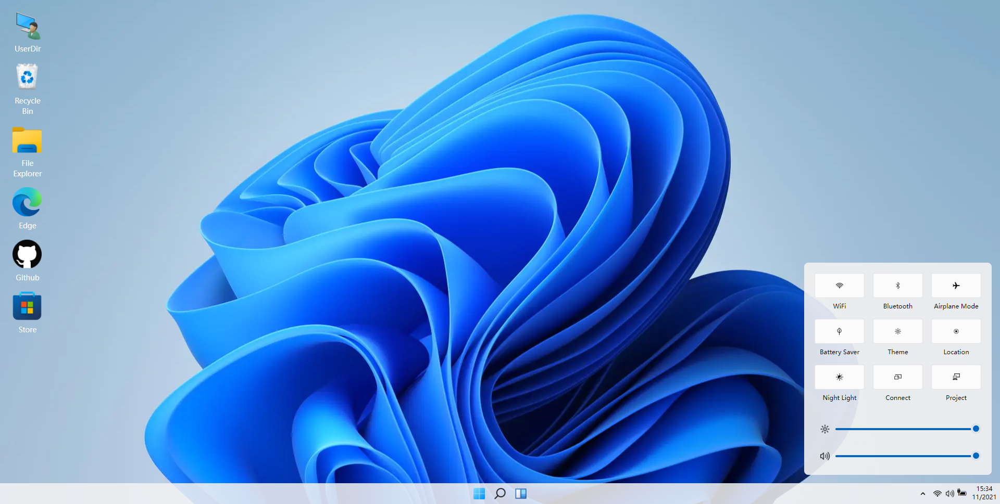

# toy-win11
### 本项目是基于 React，在 PC 端实现 Win11 桌面的展示和交互。主要实现：
- 锁屏登录页面
- 主桌面
- 功能栏部分功能

### 技术栈：React Hooks、TypeScript、TailwindCSS

## 锁屏登录页面
- 锁屏页面

- 登录页面

## icon 图标
- 桌面图标

- 点击图标实现页面跳转

## 功能栏
- 桌面任务栏

- 实现黑夜模式
